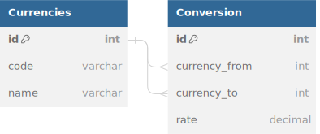

<strong>Cahier des charges - Conversion Monétaire</strong> 

<strong>Analyse client</strong>

MoneyValue est une startup du domaine de la finance qui souhaite développer une plateforme de conversion monétaire. L'objectif est de fournir un service public et gratuit permettant aux utilisateurs de convertir des devises. L'application doit être développée en utilisant Laravel comme framework back-end et Vue.js comme framework front-end.

<strong>Choix technologiques</strong>

Côté administration (front-end)
Le choix de Vue.js pour le front-end a été motivé par sa facilité d'utilisation, sa flexibilité et son écosystème riche de bibliothèques et de plugins. Vue.js permettra de créer une interface utilisateur réactive et conviviale pour l'administration.

Côté API (back-end)
L'utilisation de Laravel comme framework back-end a été choisie pour plusieurs raisons. Laravel est un framework PHP populaire qui offre une structure solide pour le développement d'applications web. Il fournit des fonctionnalités avancées telles que la gestion des routes, les contrôleurs de ressources, l'ORM Eloquent pour interagir avec la base de données, ainsi que des outils de validation et d'authentification intégrés.

<strong>Evaluation du temps de travail</strong>

Voici une estimation approximative du temps de travail pour chaque grand poste de développement (en jours de travail) :

<table>
  <thead>
    <tr>
      <th>Poste de développement</th>
      <th>Durée estimée</th>
    </tr>
  </thead>
  <tbody>
    <tr>
      <td>Configuration initiale</td>
      <td>1</td>
    </tr>
    <tr>
      <td>Développement de l'API</td>
      <td>3</td>
    </tr>
    <tr>
      <td>Développement de l'administration</td>
      <td>2</td>
    </tr>
    <tr>
      <td>Gestion de la base de données</td>
      <td>1</td>
    </tr>
    <tr>
      <td>Tests et débogage</td>
      <td>0.5</td>
    </tr>
    <tr>
      <td>Documentation</td>
      <td>0.5</td>
    </tr>
    <tr>
      <th>Total</th>
      <th>7</th>
    </tr>
  </tbody>
</table>
Veuillez noter que ces estimations peuvent varier en fonction de votre expérience, des spécificités du projet et de la complexité des fonctionnalités.

<strong>Liste fonctionnelle</strong>

Administration
Système d'authentification pour l'accès à l'administration
Affichage de la liste des paires de conversion supportées
Ajout, modification et suppression d'une paire de conversion
Affichage du nombre de requêtes effectuées pour chaque paire
API
Endpoint pour vérifier si le service est fonctionnel
Endpoint pour récupérer la liste des paires de conversion supportées
Endpoint pour effectuer une conversion de devise selon une paire existante

<strong>Recettage</strong>

<table>
  <thead>
    <tr>
      <th>Fonctionnalité</th>
      <th>Opérationnelle</th>
      <th>Observation</th>
    </tr>
  </thead>
  <tbody>
    <tr>
      <td>Système d'authentification</td>
      <td>Oui</td>
      <td></td>
    </tr>
    <tr>
      <td>Affichage des paires de conversion</td>
      <td>Oui</td>
      <td></td>
    </tr>
    <tr>
      <td>Ajout d'une paire de conversion</td>
      <td>Oui</td>
      <td></td>
    </tr>
    <tr>
      <td>Modification d'une paire de conversion</td>
      <td>Oui</td>
      <td></td>
    </tr>
    <tr>
      <td>Suppression d'une paire de conversion</td>
      <td>Oui</td>
      <td></td>
    </tr>
    <tr>
      <td>Affichage du nombre de requêtes</td>
      <td>Oui</td>
      <td></td>
    </tr>
    <tr>
      <td>Vérification du service</td>
      <td>Oui</td>
      <td></td>
    </tr>
    <tr>
      <td>Récupération des paires de conversion</td>
      <td>Oui</td>
      <td></td>
    </tr>
    <tr>
      <td>Conversion de devise</td>
      <td>Oui</td>
      <td></td>
    </tr>
  </tbody>
</table>

<strong>Diagramme de la base de données</strong>

"Je met le link ici au cas ou le diagramme ne s'affiche pas"
https://dbdiagram.io/d/64b662bc02bd1c4a5e43748c

